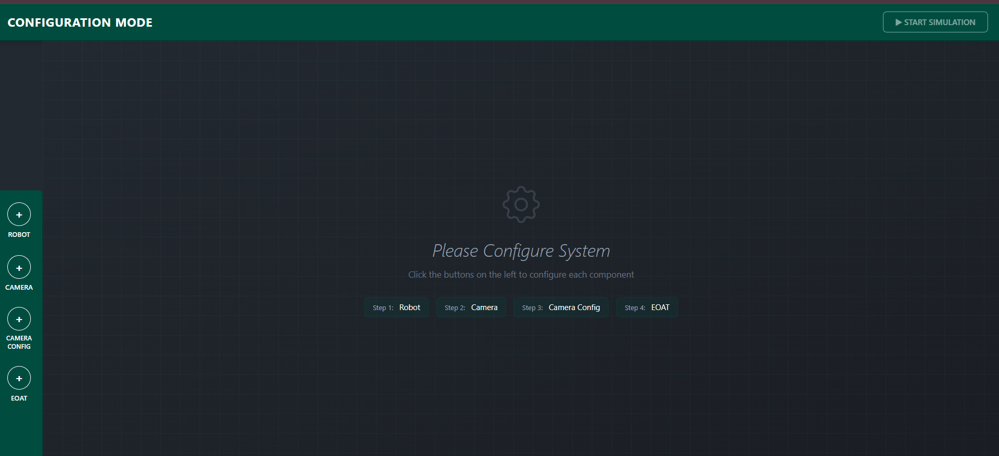
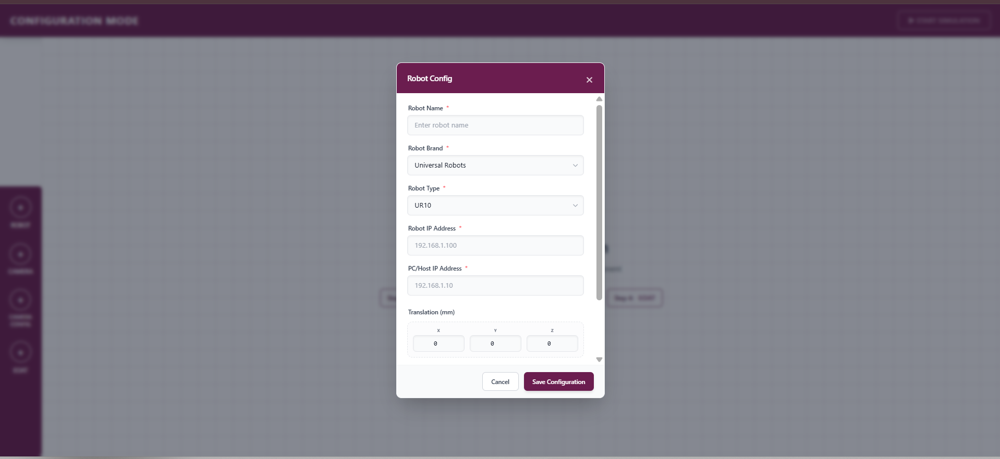
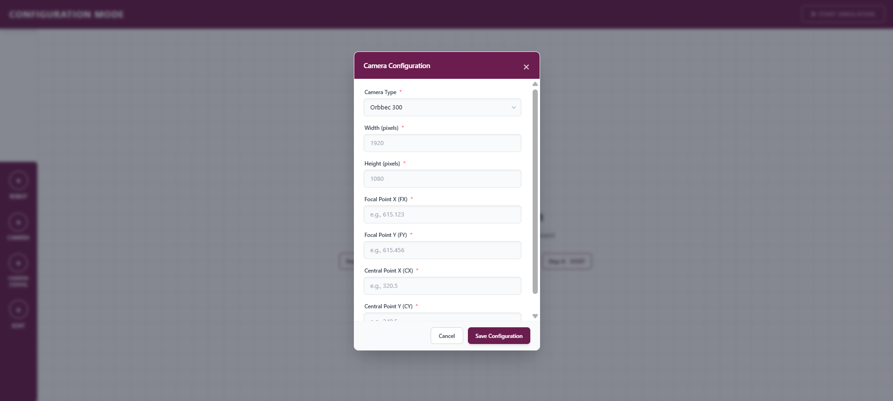
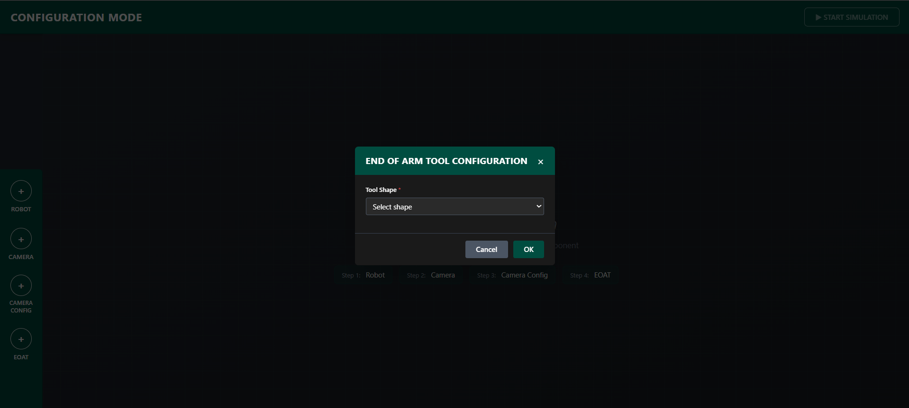

# 🤖 Robot Configuration System

> A modern web-based configuration system for industrial robots with an intuitive interface and factory pattern architecture.


---

## 📋 Table of Contents

- [Overview](#overview)
- [Features](#features)
- [Screenshots](#screenshots)
- [Installation](#installation)
- [Usage](#usage)
- [Project Structure](#project-structure)
- [Technologies Used](#technologies-used)
- [Configuration Guide](#configuration-guide)
- [Future Features](#future-features)
- [Contributing](#contributing)
- [License](#license)

---

## 🎯 Overview

The **Robot Configuration System** is a comprehensive web application designed to simplify the setup and configuration of industrial robots. This system provides an intuitive user interface for configuring robots, cameras, end-of-arm tools (EoAT), and camera calibration settings.

### Current Phase: Configuration Mode ✅

The first phase focuses on creating a robust configuration interface where users can:
- Configure robot parameters (brand, type, IP, positioning)
- Set up camera specifications (type, resolution, focal points)
- Define camera configuration (hand-in-eye vs hand-to-eye)
- Configure end-of-arm tools (shape, dimensions)

---

## ✨ Features

### ✅ **Phase 1: Configuration Mode** (Current)

#### 🤖 Robot Configuration
- Select robot brand (Universal Robots, ABB, KUKA, Fanuc)
- Choose robot type (UR5, UR10, UR20)
- Configure IP addresses (robot & host PC)
- Set position and orientation (X, Y, Z, RX, RY, RZ)

#### 📷 Camera Configuration
- Select camera type (Orbbec, Intel RealSense, Microsoft Kinect)
- Set image dimensions (width, height)
- Configure camera intrinsics (focal points, central points)

#### 🔧 Camera Teaching Configuration
- Choose teaching type:
  - **Hand-in-eye**: Camera moves with the robot
  - **Hand-to-eye**: Fixed camera position
- Upload calibration files (.yml, .yaml, .json, .toml)

#### 🔨 End-of-Arm Tool (EoAT) Configuration
- Select tool shape:
  - **Cylinder**: Define radius and height
  - **Cube**: Define length, width, and height
- Dynamic form fields based on shape selection

#### 💾 State Management
- Automatic save to localStorage
- Configuration persistence across sessions
- Real-time validation
- Visual indicators for completed configurations

#### 🎨 User Interface
- Clean, modern design with dark theme
- Responsive layout
- Modal-based configuration dialogs
- Real-time feedback and validation
- Green checkmarks for completed configurations

---

## 📸 Screenshots

> **Note**: Screenshots are stored in the `docs/images/` directory

### Configuration Mode

*Main configuration interface with sidebar*

### Robot Configuration Modal

*Robot configuration dialog*

### Camera Configuration

*Camera setup interface*

### EOAT Configuration

*End-of-arm tool configuration with dynamic fields*


---

## 🚀 Installation

### Prerequisites

- **Node.js** v16 or higher
- **npm** v8 or higher
- Modern web browser (Chrome, Firefox, Edge)

### Setup Steps

1. **Clone the repository**
```bash
   git clone https://github.com/Radwan-sukkari/robot_config.git
   cd robot-config
   cd config
  
```

2. **Install dependencies**
```bash
   npm install
```

3. **Run development server**
```bash
   npm run dev
```

4. **Open in browser**
```
   Navigate to: http://localhost:5173
```

### Build for Production
```bash
npm run build
```

The built files will be in the `dist/` directory.

---

## 📖 Usage

### Basic Workflow

1. **Start the application**
```bash
   npm run dev
```

2. **Configure components** (click buttons in left sidebar):
   - ➕ **Robot**: Set robot brand, type, IP, and positioning
   - ➕ **Camera**: Configure camera type and parameters
   - ➕ **Camera Config**: Choose teaching type and upload calibration
   - ➕ **EOAT**: Define tool shape and dimensions

3. **Complete all configurations**
   - Green checkmarks appear when each component is configured
   - "Start Simulation" button becomes active when all components are ready

4. **Start simulation**
   - Click "▶ Start Simulation" to proceed to Phase 2 (Live Simulation Mode)

### Keyboard Shortcuts

- `Esc` - Close any open modal
- Click outside modal - Close modal

### Reset Configuration

Open browser console and run:
```javascript
window.resetMyConfig()
```

---

## 📁 Project Structure
```
robot-config-system/
├── docs/
│   └── images/              # 📸 Screenshots go here
│       ├── config-overview.png
│       ├── robot-config.png
│       ├── camera-config.png
│       ├── eoat-config.png
│       └── configured.png
│
├── public/
│   └── urdf/                # URDF robot files (future use)
│
├── src/
│   ├── components/
│   │   ├── modals/
│   │   │   ├── BaseModal.js          # 🏗️ Base modal class
│   │   │   ├── ModalFactory.js       # 🏭 Factory pattern
│   │   │   └── configs/
│   │   │       ├── robotConfig.js    # Robot configuration
│   │   │       ├── cameraConfig.js   # Camera configuration
│   │   │       ├── cameraConfigConfig.js # Camera teaching config
│   │   │       └── eoatConfig.js     # EOAT configuration
│   │   │
│   │   ├── header.js         # Header component
│   │   ├── sidebar.js        # Sidebar with config buttons
│   │   └── scene.js          # Main scene container
│   │
│   ├── state/
│   │   ├── configState.js    # 💾 Configuration state management
│   │   └── sceneState.js     # Scene state (future use)
│   │
│   ├── utils/
│   │   └── validators.js     # ✅ Validation utilities
│   │
│   ├── main.js               # 🚀 Application entry point
│   └── style.css             # Global styles
│
├── index.html                # Main HTML file
├── package.json              # Dependencies
├── tailwind.config.js        # Tailwind configuration
├── vite.config.js            # Vite configuration
└── README.md                 # This file
```

---

## 🛠️ Technologies Used

### Frontend Framework
- **Vite** - Lightning-fast build tool
- **Vanilla JavaScript** (ES6+) - No framework overhead
- **HTML5** & **CSS3**

### Styling
- **Tailwind CSS** - Utility-first CSS framework
- **Custom Design System** - Dark theme with teal accents

### Design Patterns
- **Factory Pattern** - For modal creation and management
- **State Management** - Centralized configuration state
- **Module Pattern** - Clean code organization

### Storage
- **LocalStorage** - Configuration persistence

### Development Tools
- **PostCSS** - CSS processing
- **Autoprefixer** - Browser compatibility

---

## ⚙️ Configuration Guide

### Robot Configuration

| Field | Type | Description | Example |
|-------|------|-------------|---------|
| Robot Name | Text | Custom robot identifier | "Production Robot 01" |
| Robot Brand | Select | Manufacturer | Universal Robots |
| Robot Type | Select | Model number | UR10 |
| Robot IP | Text | Robot IP address | 192.168.1.100 |
| PC/Host IP | Text | Host computer IP | 192.168.1.10 |
| Translation | Numbers | Position (mm) | X: 0, Y: 0, Z: 0 |
| Rotation | Numbers | Orientation (degrees) | RX: 0, RY: 0, RZ: 0 |

### Camera Configuration

| Field | Type | Description | Example |
|-------|------|-------------|---------|
| Camera Type | Select | Camera model | Intel RealSense |
| Width | Number | Image width (pixels) | 1920 |
| Height | Number | Image height (pixels) | 1080 |
| FX | Number | Focal point X | 615.123 |
| FY | Number | Focal point Y | 615.456 |
| CX | Number | Central point X | 320.5 |
| CY | Number | Central point Y | 240.5 |

### Camera Teaching Configuration

| Field | Type | Description |
|-------|------|-------------|
| Teaching Type | Select | Hand-in-eye or Hand-to-eye |
| Calibration File | File | .yml, .yaml, .json, or .toml file |

### EOAT Configuration

#### Cylinder
| Field | Type | Description | Example |
|-------|------|-------------|---------|
| Radius | Number | Cylinder radius (mm) | 50 |
| Height | Number | Cylinder height (mm) | 100 |

#### Cube
| Field | Type | Description | Example |
|-------|------|-------------|---------|
| Length | Number | Cube length (mm) | 50 |
| Width | Number | Cube width (mm) | 50 |
| Height | Number | Cube height (mm) | 100 |

---

## 🔮 Future Features

### Phase 2: Live Simulation Mode (In Development)

- [ ] 3D robot visualization with Three.js
- [ ] Real-time robot model loading (URDF support)
- [ ] Interactive 3D scene
- [ ] Object manipulation (translation, rotation)
- [ ] Properties panel for scene objects
- [ ] Class list for managing objects

---

## 🤝 Contributing

Contributions are welcome! Please follow these steps:

1. Fork the repository
2. Create a feature branch (`git checkout -b feature/AmazingFeature`)
3. Commit your changes (`git commit -m 'Add some AmazingFeature'`)
4. Push to the branch (`git push origin feature/AmazingFeature`)
5. Open a Pull Request

### Code Style

- Use ES6+ features
- Follow existing naming conventions
- Add comments for complex logic
- Update README for new features

---


## 👨‍💻 Author

**Radwan Sukkari**
- GitHub: [@Radwan-sukkari](https://github.com/Radwan-sukkari)
- Email: radwansukkari123@gmail.com

---

## 🙏 Acknowledgments

- Three.js community for 3D visualization resources
- Tailwind CSS for the excellent utility framework
- Universal Robots for robot documentation

---


